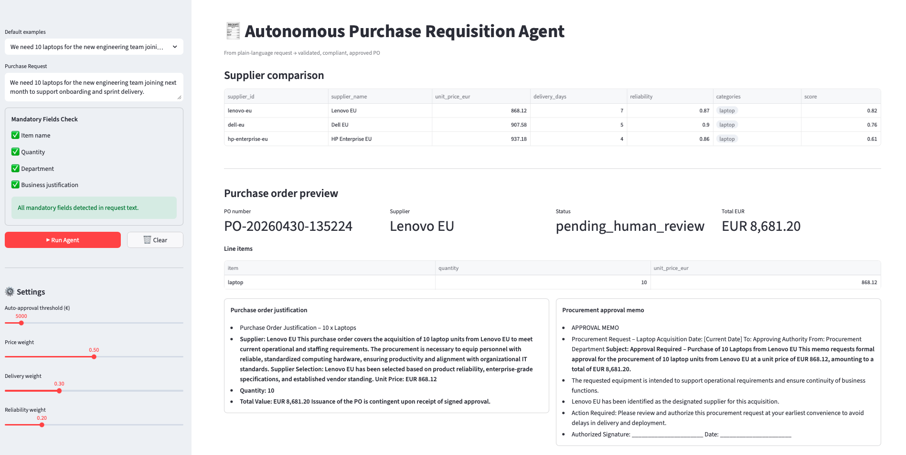

# 🧾 Autonomous Purchase Requisition Agent

> *"From request → approved Purchase Order (PO), with minimal human input"*

A multi-agent AI system that takes a plain-language purchase request like **"We need 10 laptops for the new team"** and autonomously produces a **validated, compliant, and approved Purchase Order** — by orchestrating specialized AI agents via LangGraph, grounding decisions in company policy, and generating synthetic supplier options for comparison.

---

## 🎯 Project Overview

Modern procurement processes are slow, manual, and error-prone. An employee submits a request, someone manually checks the budget, another person finds suppliers, someone else routes it for approval — days or weeks pass before a PO is issued.

This project replaces that pipeline with an **autonomous AI agent system** that:

1. Understands a natural-language purchase request **[LLM used: No]**
2. Retrieves internal procurement policies using RAG **[LLM used: No]**
3. Generates synthetic supplier options from the request category and quantity **[LLM used: No]**
4. Compares options by price, delivery time, and reliability **[LLM used: Yes]**
5. Validates the request against mandatory policy fields and approval constraints **[LLM used: Yes]**
6. Routes for human approval when required (above threshold) **[LLM used: No]**
7. Generates and delivers a formatted Purchase Order **[LLM used: Yes]**

The entire flow is orchestrated by **LangGraph** (a stateful multi-agent framework) with LLM reasoning in policy, optimization, and approval-text generation stages. MCP integration assets remain in the repo as optional extension paths.

---

## 🔍 How This Project Works

```
User Input (Streamlit UI)
        │
        ▼
┌───────────────────┐
│  Interpreter Agent │  ← Parses intent, quantity, category, urgency
└────────┬──────────┘
         │
         ▼
┌───────────────────┐
│   Policy Agent    │  ← RAG over procurement_policy.md + approval_thresholds.md
└────────┬──────────┘
         │
         ▼
┌───────────────────┐
│  Supplier Agent   │  ← Generates synthetic supplier quotes
└────────┬──────────┘
         │
         ▼
┌───────────────────┐
│ Optimizer Agent   │  ← Scores suppliers: price × delivery × reliability
└────────┬──────────┘
         │
         ▼
┌───────────────────┐
│  Approval Agent   │  ← Applies approval threshold; generates memo + PO text
└────────┬──────────┘
         │
         ▼
  📄 Purchase Order preview
  + Procurement approval memo
```

Each agent has a **specific role** and passes structured state to the next agent via LangGraph's state machine. If any agent fails validation (e.g., missing mandatory fields, no supplier options), it can loop back or halt with a clear reason.

---

## 🤖 How Agents Work

An **AI agent** is an LLM (Large Language Model) that can:

1. **Reason** — understand a goal and plan steps to achieve it
2. **Act** — call tools (like MCP servers) to take actions in the world
3. **Observe** — receive tool results and update its understanding
4. **Iterate** — keep reasoning and acting until the goal is complete

This is the **ReAct loop** (Reason → Act → Observe):

```
┌─────────────────────────────────────────┐
│                                         │
│   THINK: "I need supplier quotes for    │
│           20 laptops under €800 each"   │
│                ↓                        │
│   ACT:   call search_suppliers(         │
│             category="laptop",          │
│             max_price=800, qty=20)      │
│                ↓                        │
│   OBSERVE: [{supplier: "Dell", ...},    │
│             {supplier: "Lenovo", ...}]  │
│                ↓                        │
│   THINK: "Dell is cheaper but Lenovo    │
│           delivers faster. Policy says  │
│           prefer EU suppliers..."       │
│                ↓                        │
│   ACT:   call get_quote(supplier_id=    │
│             "lenovo-eu", ...)           │
│                                         │
└─────────────────────────────────────────┘
```

### Why Multiple Agents?

A single agent doing everything gets confused on complex tasks. **Specialised agents** are:

- **More reliable** — each agent is prompted and optimised for one job
- **More debuggable** — you can inspect each agent's output independently
- **More composable** — agents can be reused in other workflows

### How LangGraph Orchestrates Agents

**LangGraph** models the agent pipeline as a **directed graph**:

- **Nodes** = agent functions (each agent is a node)
- **Edges** = transitions between agents (can be conditional)
- **State** = shared data object passed through the entire graph

```python
graph = StateGraph(RequisitionState)

graph.add_node("interpreter", interpreter_agent)
graph.add_node("policy",      policy_agent)
graph.add_node("supplier",    supplier_agent)
graph.add_node("optimizer",   optimizer_agent)
graph.add_node("approval",    approval_agent)

graph.add_edge("interpreter", "policy")
graph.add_edge("policy",      "supplier")
graph.add_edge("supplier",    "optimizer")
graph.add_conditional_edges(
    "optimizer",
    route_approval,          # decides: auto-approve or human review?
    {"auto": "approval", "human": "approval"}
)
```

The **state** flows through every node, accumulating results:

```python
class RequisitionState(TypedDict):
    raw_request:      str           # "We need 20 laptops"
    parsed_items:     list[Item]    # [{name: laptop, qty: 20}]
    policy_result:    PolicyCheck   # {compliant: True, notes: [...]}
    supplier_quotes:  list[Quote]   # [{supplier, price, delivery}]
    best_quote:       Quote         # selected supplier
    approval_needed:  bool
    approval_status:  str           # pending / approved / rejected
    purchase_order:   PurchaseOrder # final PO
```

---

## 🧠 Agent Roles

### 1. Interpreter Agent
**Goal:** Parse the raw user request into a structured requisition.

- Extracts: item name, quantity, urgency, department, estimated budget
- Handles ambiguity: "some laptops" → asks for clarification
- Output: `ParsedRequisition` model

### 2. Policy Agent
**Goal:** Check that the request complies with procurement rules.

- Uses RAG to retrieve relevant sections of `procurement_policy.md`
- Checks: preferred supplier lists, category restrictions, sustainability rules
- Looks up approval thresholds (e.g., >€5,000 requires manager sign-off)
- Output: `PolicyCheck` with `compliant: bool` and list of applicable rules

### 3. Supplier Agent
**Goal:** Generate realistic supplier options for the requested category and quantity.

- Uses synthetic supplier generation logic by category (e.g. laptop, desk, usb-c cable)
- Produces multiple options with unit price, delivery days, and reliability
- Supports downstream weighted comparison in Optimizer Agent
- Output: list of `SupplierQuote` objects

### 4. Optimizer Agent
**Goal:** Score and rank supplier options, select the best one.

- Scoring formula: `score = (price_weight × price_score) + (delivery_weight × delivery_score) + (reliability_weight × reliability_score)`
- Weights configurable in `config/settings.py`
- Applies policy preferences (e.g., EU suppliers preferred)
- Output: ranked list + recommended `best_quote`

### 5. Approval Agent
**Goal:** Handle the approval routing and final PO generation.

- If amount < auto-approval threshold → approves automatically
- If amount ≥ threshold → marks for human review
- Generates procurement approval memo + PO justification text via LLM
- Output: `PurchaseOrder` with status

---

## 📁 Project Structure

```
purchase-requisition-agent/
│
├── README.md                        # This file
├── main.py                          # Entry point (non-UI)
├── pyproject.toml                   # Dependencies (uv / pip)
├── .env.example                     # Environment variable template
├── .gitignore
│
├── ui/                              # Streamlit demo app
│   ├── app.py                       # Main Streamlit entry point
│   ├── components.py                # Reusable UI widgets
│   └── session_state.py             # Streamlit state management
│
├── agents/                          # LangGraph agent nodes
│   ├── base_agent.py                # Shared agent base class
│   ├── interpreter_agent.py         # Step 1: Parse request
│   ├── policy_agent.py              # Step 2: Check compliance
│   ├── supplier_agent.py            # Step 3: Query vendors
│   ├── optimizer_agent.py           # Step 4: Rank & select
│   └── approval_agent.py            # Step 5: Budget + approval + PO
│
├── graph/                           # LangGraph workflow definition
│   ├── state.py                     # RequisitionState TypedDict
│   ├── nodes.py                     # Node wrapper functions
│   ├── edges.py                     # Conditional edge logic
│   └── workflow.py                  # Graph assembly + compilation
│
├── mcp_servers/                     # MCP server implementations
│   ├── erp/
│   │   ├── server.py                # MCP server: ERP tools
│   │   └── client.py                # MCP client wrapper
│   ├── supplier/
│   │   ├── server.py                # MCP server: supplier catalog tools
│   │   └── client.py
│   ├── policy/
│   │   ├── server.py                # MCP server: policy RAG tools
│   │   └── client.py
│   ├── budget/
│   │   ├── server.py                # MCP server: budget DB tools
│   │   └── client.py
│   └── approval/
│       ├── server.py                # MCP server: Slack/email tools
│       └── client.py
│
├── models/                          # Pydantic data models
│   ├── requisition.py               # ParsedRequisition, Item
│   ├── purchase_order.py            # PurchaseOrder, POLineItem
│   ├── supplier.py                  # Supplier, Quote
│   └── policy.py                    # PolicyRule, PolicyCheck
│
├── tools/                           # Non-MCP utility tools
│   ├── rag_retriever.py             # Vector search over policy docs
│   ├── po_generator.py              # PDF PO generation
│   ├── slack_notifier.py            # Slack webhook integration
│   └── email_sender.py              # SMTP email integration
│
├── config/
│   ├── settings.py                  # App settings (Pydantic BaseSettings)
│   ├── mcp_config.py                # MCP server URLs + credentials
│   └── logging_config.py            # Structured logging setup
│
├── data/
│   ├── policies/
│   │   ├── procurement_policy.md    # Source of truth for policy RAG
│   │   └── approval_thresholds.md   # Approval tier definitions
│
├── scripts/
│   ├── run_agent.py                 # CLI to run agent without UI
│   └── start_mcp_servers.sh         # Start all MCP servers locally
│
├── docs/
│   ├── architecture.md              # Detailed architecture diagrams
│   ├── mcp_servers.md               # MCP server API reference
│   └── agent_roles.md               # Agent prompt engineering notes
│
└── tests/
    ├── unit/
    │   ├── test_agents.py
    │   ├── test_models.py
    │   └── test_tools.py
    └── integration/
        ├── test_workflow.py          # End-to-end graph tests
        └── test_mcp_servers.py       # MCP server contract tests
```

---

## 🚀 Getting Started

### Installation

```bash
# From project root

# Install dependencies with uv (recommended)
# Creates/updates the virtual environment and syncs dependencies from pyproject.toml
uv sync

# Or with pip
pip install -e ".[dev]"

# Copy and fill in environment variables
cp .env.example .env
```

### Environment Variables

```bash
# .env
ANTHROPIC_API_KEY=sk-ant-...
LLM_PROVIDER=anthropic
LLM_MODEL=claude-sonnet-4-6
LLM_MAX_TOKENS=1000

# Optimizer weights (must sum to 1.0)
PRICE_WEIGHT=0.5
DELIVERY_WEIGHT=0.3
RELIABILITY_WEIGHT=0.2

# Auto-approval threshold (EUR)
AUTO_APPROVAL_THRESHOLD=5000
```

---

## 🎬 Running the Demo

### Current default runtime (important)

- Supplier comparison is generated from synthetic supplier logic (`tools/synthetic_suppliers.py`)
- Synthetic supplier data is intentionally limited for demonstration; for real procurement scenarios, integrate your organization's supplier master/catalog data (via MCP or internal APIs)
- Policy, optimization, and approval text are LLM-driven

### 1. Configure environment

```bash
cp .env.example .env
# Fill ANTHROPIC_API_KEY in .env
```

### 2. Launch Streamlit UI

```bash
streamlit run app.py
```

Open [http://localhost:8501](http://localhost:8501), type a purchase request, and watch the agent pipeline execute step by step.

### 3. Or run via CLI

```bash
python scripts/run_agent.py --request "We need 20 laptops for the new team"
```

---

## 🖥️ Streamlit Demo UI

The UI (`app.py`) provides:

- **Request input** — free-text field for the purchase request
- **Mandatory fields check** — live validation of required requisition fields
- **Live agent trace** — expandable step-by-step view of each agent's reasoning
- **Supplier comparison table** — ranked quotes with scoring breakdown
- **PO preview** — structured PO summary with justification and approval memo cards
- **Approval status** — clear pending/approved/blocked status

---

## 🧩 Use Case

This diagram summarizes the end-to-end procurement use case implemented in this project.



Business scenario: an employee submits a purchase request, agents validate policy compliance, compare synthetic supplier options, route approval when needed, and produce a ready-to-issue purchase order.